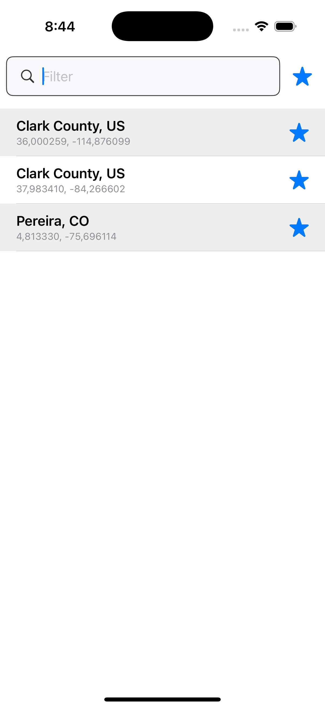
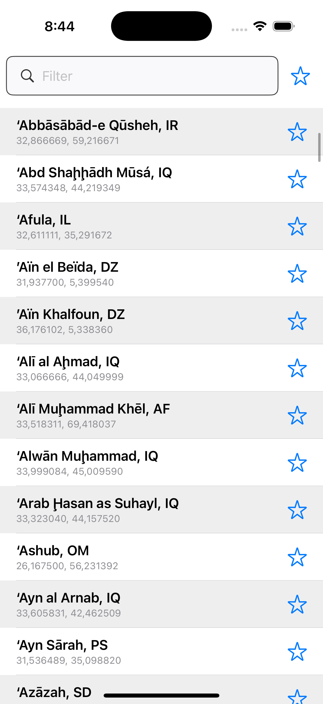
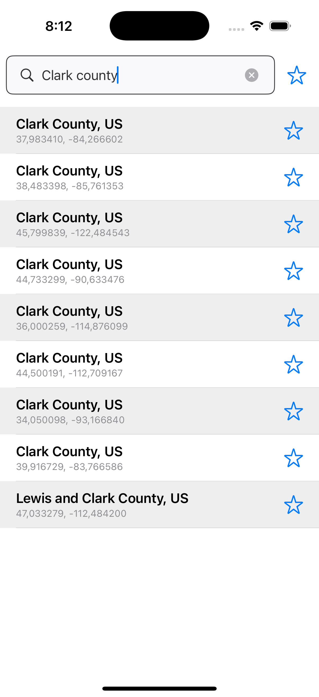
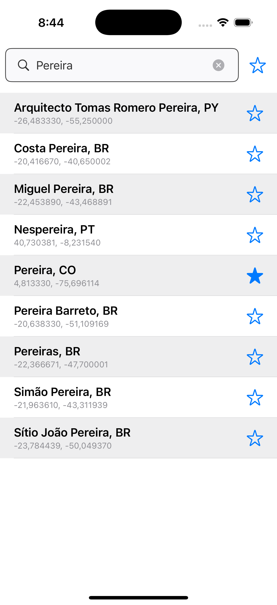
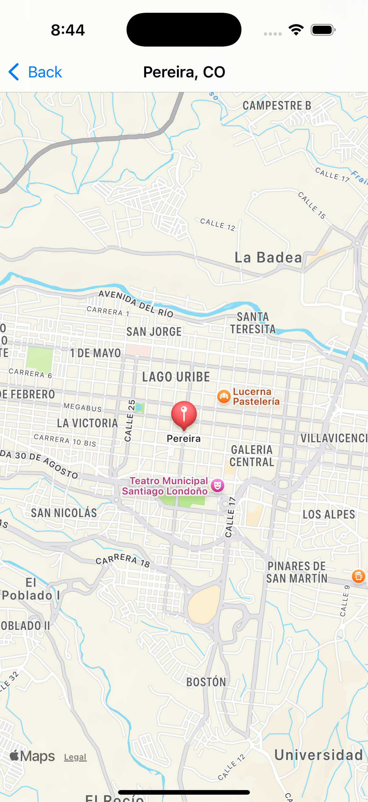
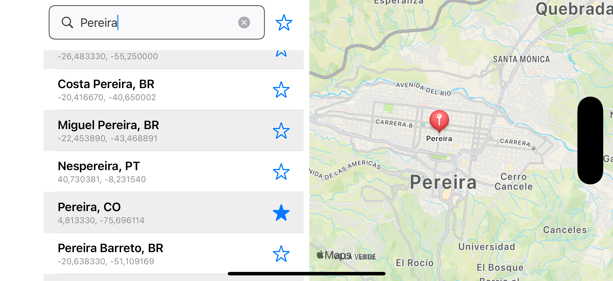

# UalaTest

Repositorio para el Challenge de Uala

Este proyecto es una aplicación de búsqueda y visualización de ciudades que consume una API de ciudades. La aplicación permite a los usuarios buscar ciudades por nombre, ver detalles de cada ciudad y proporciona una interfaz adaptativa para diferentes orientaciones de pantalla (portrait y landscape).

# Características

- **Búsqueda en Tiempo Real:** Busca ciudades mediante un campo de texto con filtrado en tiempo real.

- **Lista de Ciudades:** Visualización de las ciudades en una lista desplazable, mostrando nombre y país, coordenadas y poder marcar como favorita o no.
- **Detalle de Ciudad:** Al seleccionar una ciudad, se muestran el mapa y un marcado con las coordenadas.
- **SwiftData:** Se uso este framework para el almacenamiento de los datos, adicional se usa para marcar como favorita una ciudad.
- **Arquitectura MVVM:** Separación clara de la lógica de negocio y la vista, facilitando el mantenimiento y la escalabilidad.

## Arquitectura

La aplicación sigue la arquitectura MVVM (Model-View-ViewModel), aprovechando SwiftUI para la construcción de la interfaz de usuario.

## Estructura del Proyecto

- **Modelos:** Representación de los datos de la ciudad obtenidos de la API y para gestionar los datos almacenados en SwiftData
- **Vista:** Componentes de interfaz de usuario construidos con SwiftUI, diseñados para ser reutilizables y adaptativos tanto orientación portrait como landscape.
- **ViewModel:** Maneja la lógica de presentación, interactúa con los modelos, y prepara los datos para la vista.
- **Managers:** Clases responsables de manejar diferentes aspectos de la aplicación, como las solicitudes de red y la gestión de datos locales.

## Tecnologías Utilizadas

- **SwiftUI:** Framework declarativo para la construcción de interfaces de usuario.
- **Combine:** Framework para manejar eventos asincrónicos.
- **ViewInspector:** Framework para realizar pruebas unitarias de vistas de SwiftUI, el challenge especificaba ningun SDK de terceros pero este es para pruebas unitarias y solo a algunas vistas (View).

## Requisitos de sistema
Xcode 16.2 y iOS 18.

# Desafíos y Decisiones

Debido a que el API expuesta siempre responde con los mismos datos, el enfoque para esta prueba se estructuró de la siguiente manera:

- **Pantalla Splash**: La descarga de los datos se realiza una única vez a través de está. Esto permite cargar la información necesaria al inicio de la aplicación de manera eficiente.
- **SwiftData**: Una vez descargados, se usa esta herramienta para almacenar y  realizar las búsquedas y el ordenamiento requerido.
    - **Optimización:** Ordenar y filtrar un arreglo de más de 200,000 registros directamente no es eficiente ni óptimo.
     
        _SwiftData_ maneja estas operaciones de manera más efectiva, garantizando el rendimiento esperado.
    - **Marcado de Favoritos:** SwiftData se utiliza también para marcar y persistir las ciudades favoritas seleccionadas por el usuario. Esto permite que las preferencias del usuario se mantengan entre sesiones.

- Una vez descargada y almacenada la informacion, se muestra la lista de ciudades, esto se maneja con _defaults_ para recordar el estado entre los lanzamientos de la aplicación.

## Componentes

- **Manejo de Datos:** Se creó un ApiManager para manejar las solicitudes de API y un DataManager para gestionar los datos locales.

- **Reutilización de Vistas:** Las vistas de la lista y el detalle de la ciudad fueron diseñadas para reutilizarse en ambas orientaciones, mejorando la eficiencia y la cohesión del código.

- **Optimización de Búsquedas:** Se implementó **debounce** de combine (Esperar 1 segundo hasta que el usuario deje de escribir) para realizar la búsqueda y mejorar el rendimiento y asi evitar solicitudes innecesarias que sobrecarguen el sistema.
 
    Adicional las busquedas recientes se almacenan en **cache** (Diccionario), en tiempo de ejecucion, para no tener que acceder siempre a la data almacenada en local y asi mejorar los tiempos de respuesta y optimización. 

## Pruebas

Se implementaron pruebas unitarias y de interfaz para asegurar la funcionalidad y estabilidad de la aplicación.

- **Pruebas Unitarias:** Se probaron los ViewModels y los Managers para verificar la lógica de negocio.
- **Pruebas de UI:** Usando ViewInspector, se verificaron las vistas y la interacción del usuario.

## Nota

La data de las ciudad contiene multiples entradas repetidas, estas comparten el mismo nombre y pais, pero tienen diferentes coordenadas e identificadores únicos (ID). 

Esto puede resultar en que ciertas ciudades aparezcan varias veces en los resultados de búsqueda. ejemplo __Clark County, US__

***

      
        
 